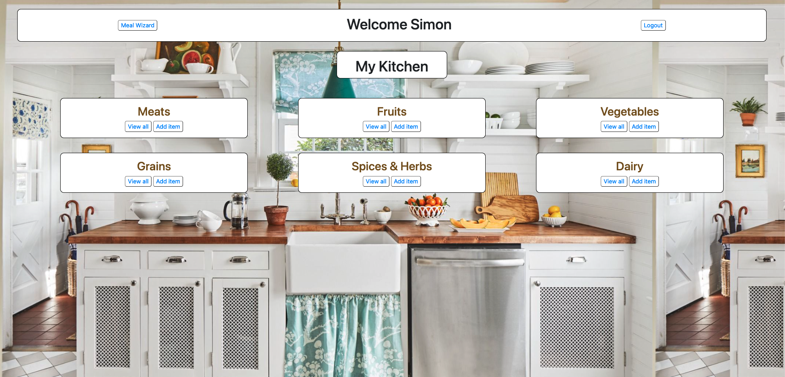
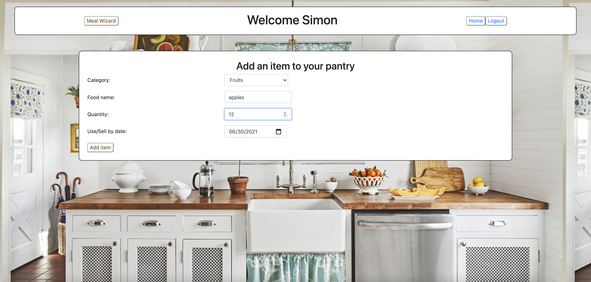
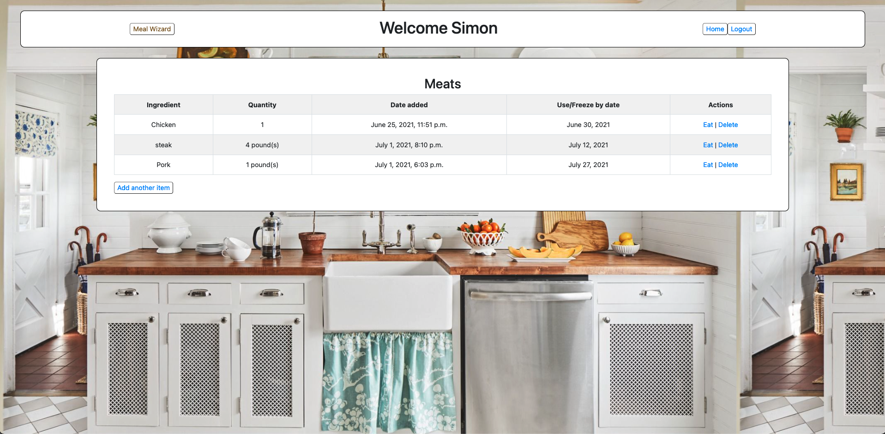
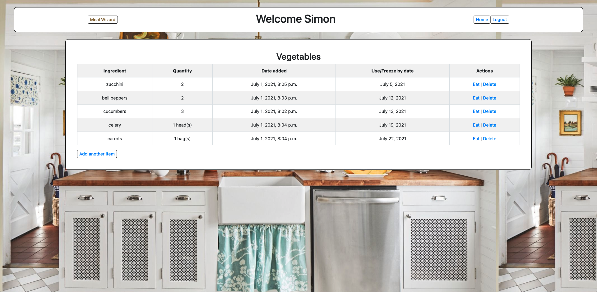
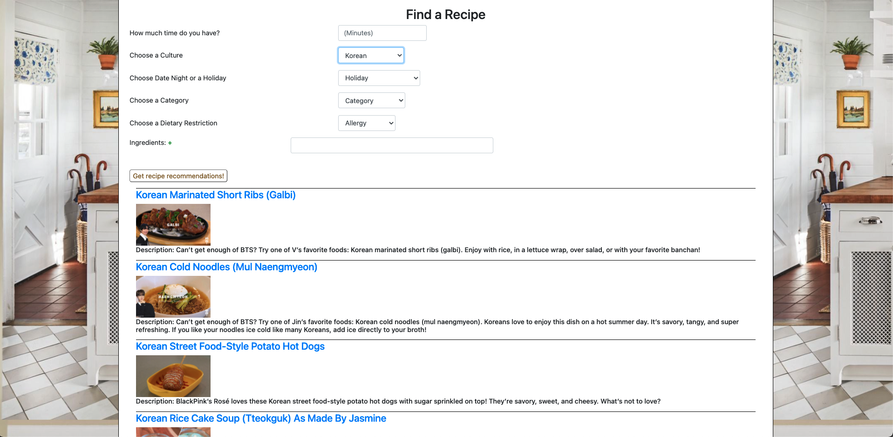

# UseMyLeftovers
### Constructed a FullStack Python Django dinner planning app, as part of a small team 
### imitates Allrecipes’s dinner planner with a more internationalized, tailored approach for using up expiring ingredients, and an option for holiday themes, date night, slowcooker meals and filtering for dietary restrictions.
### includes section for uploading ingredients in a users pantry which are filtered by category and by expiration date

